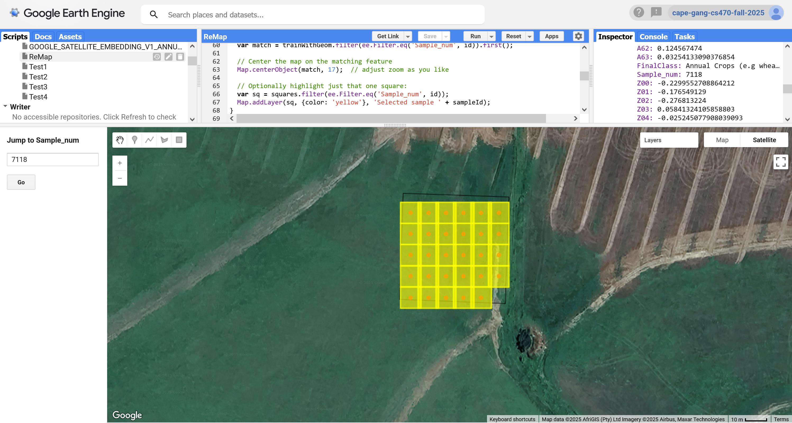

# CS470-South-Africa-Landcover-2025
## The Code and data from SSU's CS470 FInal Project: Landcover identification in South Africa
 

### By: Shelby Anderson, Steven Tuft, Cooper Hochman

 
 

  

 

### How to Run Code

Our code is built in Jupyter Notebooks meant to run in Google Colab.

